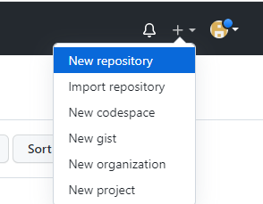
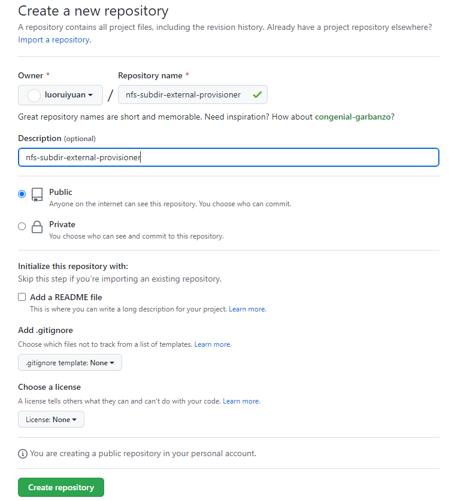
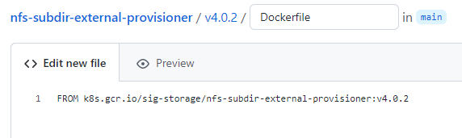
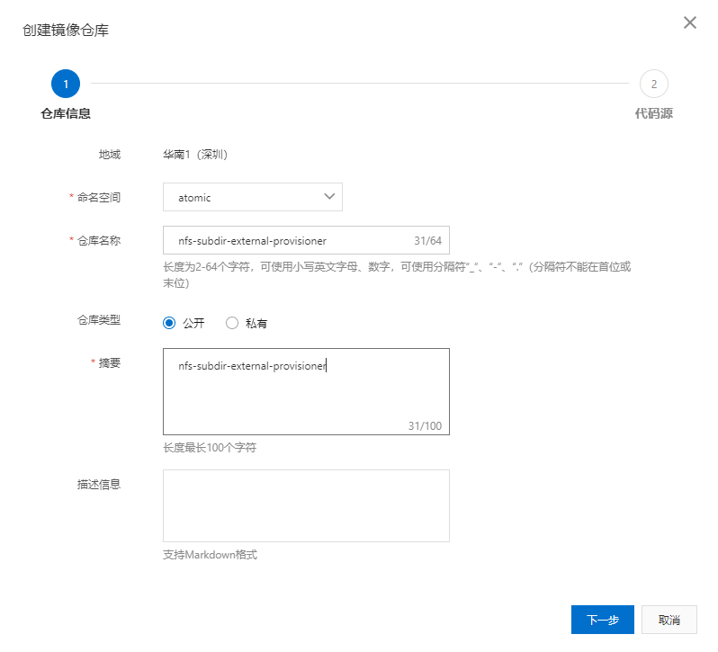
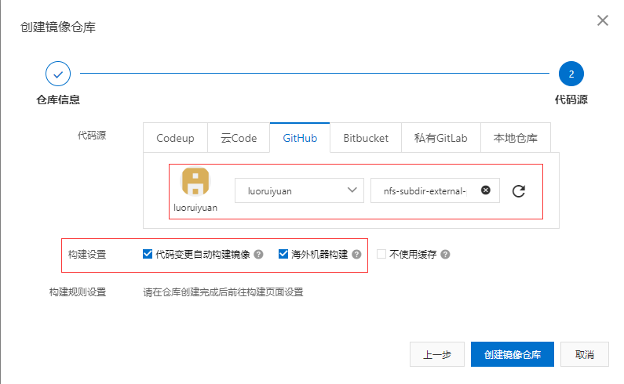
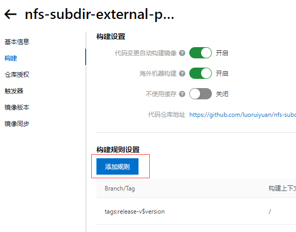
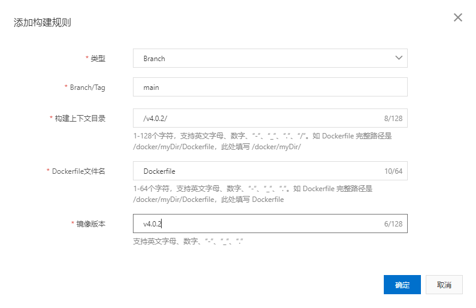
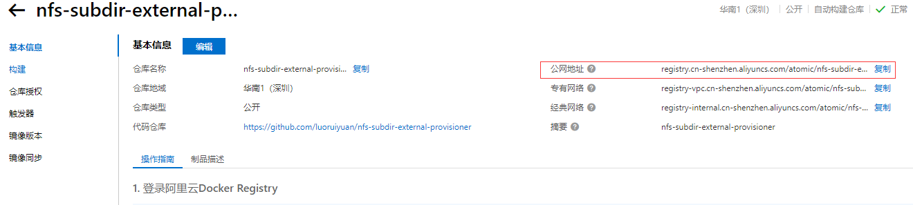

## 支持的下载

|           名称            |                                镜像地址                                |  镜像版本   |
|:-----------------------:|:------------------------------------------------------------------:|:-------:|
| prometheus/alertmanager | registry.cn-hangzhou.aliyuncs.com/docker_image_google/alertmanager | v4.0.2  |
|  prometheus/prometheus  |  registry.cn-hangzhou.aliyuncs.com/docker_image_google/prometheus  | v2.46.0 |

## 阿里容器镜像服务下载海外镜像

k8s.gcr.io/sig-storage/nfs-subdir-external-provisioner:v4.0.2镜像国内下载不下了，我们就要借助阿里加速镜像服务器进行下载

1. 创建仓库



2. 镜像名称当仓库名称



3. 创建Dockerfile文件,最好创建一个版本号文件夹



```dockerfile
FROM k8s.gcr.io/sig-storage/nfs-subdir-external-provisioner:v4.0.2
```

4. 阿里创建镜像仓库



5. 绑定github账号



6. 创建构建规则



上下文目录为：github中的Dockfile文件的目录



7. 构建成功后下载镜像



8.下载镜像

```shell
docker pull registry.cn-shenzhen.aliyuncs.com/atomic/nfs-subdir-external-provisioner:v4.0.2
```
